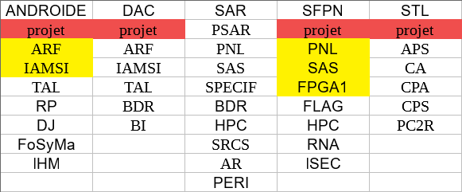

# Une idée des masters

#### Fichiers récupérés sur internet dans le but de donner une idée des UE de master informatique à l'UPMC (masters ANDROIDE, DAC, SAR, SFPN et STL).  
Recherchez avec github le code d'une UE pour voir si il y a un dossier qui lui correspond.  
lien donnant le [nom complet, le nom réduit et le code de chaque UE](http://www-master.ufr-info-p6.jussieu.fr/ue/2014/).

# Tableau récapitulatif des choix possibles au S1 et S2
##### Je n'ai pas trouvé de source officielle sur internet mais il peut être possible de changer de master après le M1S1 si on a suivi les UE obligatoires du master de destination.
Tableaux donnés à titre indicatif, ne pas leur accorder trop de confiance.  

#### Semestre 1 :  ([voir tableau plus détaillé](https://raw.githubusercontent.com/keyber/masterUPMC/master/S1/UES1.png))  

  
1 : obligatoire  
2 : fortement recommandée  
3 : conseillée (ou "seules autres UE autorisées" selon les masters)  
en rouge : les UE obligatoires  
en jaune : les groupes d'UE pour lesquels on ne peut en choisir qu'une

#### Semestre 2 :  
  

### Site des masters:  
http://androide.lip6.fr/  
http://dac.lip6.fr/master/  
http://www-master.ufr-info-p6.jussieu.fr/lmd/  

lien vers le [diplôme d'excellence](http://www-master.ufr-info-p6.jussieu.fr:8080/espace_etudiant/doc_notes/diplomeexcellence.pdf).  

###### Notes techniques :  
- Il y a plein d'UE que je n'ai pas cherché/trouvé. Et pour chaque UE, il y a plein de documents que je n'ai pas obtenu
- Il y a de fortes chances que le contenu des UE ait changé.
- Dès que quelques documents étaient trouvés pour une UE, je passais à une autre UE sans chercher d'avantage de documents.  
- Résultats obtenus à partir des sites des UEs, les informations entre le site dédié
et la description sur http://www-master.ufr-info-p6.jussieu.fr/lmd/ ne sont pas toujours cohérentes.  
- Fichiers obtenus après une semaine de [web scraping](https://en.wikipedia.org/wiki/Web_scraping)
manuel avec l'aide de [JDownloader](http://jdownloader.org/).  
- L'opération a été effectuée le 01/10/2017 environ.  
- J'ai principalement cherché sur les sites des masters,  
https://www-master.ufr-info-p6.jussieu.fr:8083/2017/  
http://www-master.ufr-info-p6.jussieu.fr/ue/2014/description.php?code_ue=4I901  
(en faisant varier la date dans l'URL directement pour accéder aux ressources ds années antérieures)  
et fait des recherches google.
- Je ne compte pas continuer à chercher des documents mais toute aide reste bienvenue.

